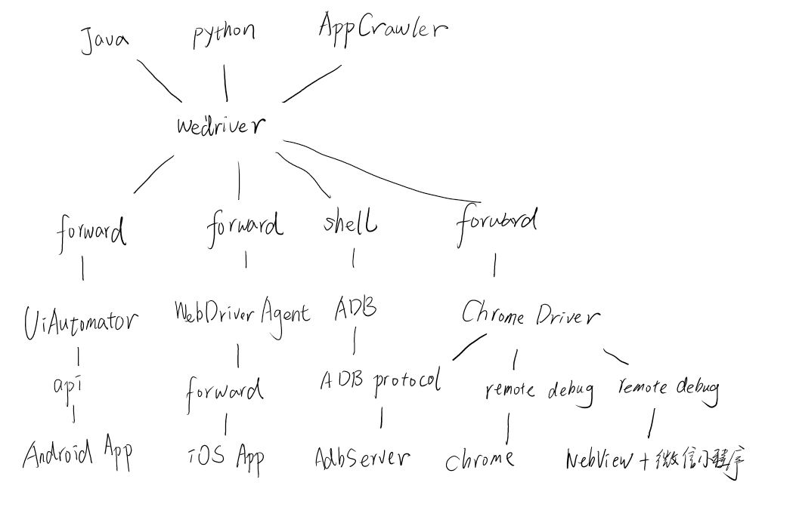
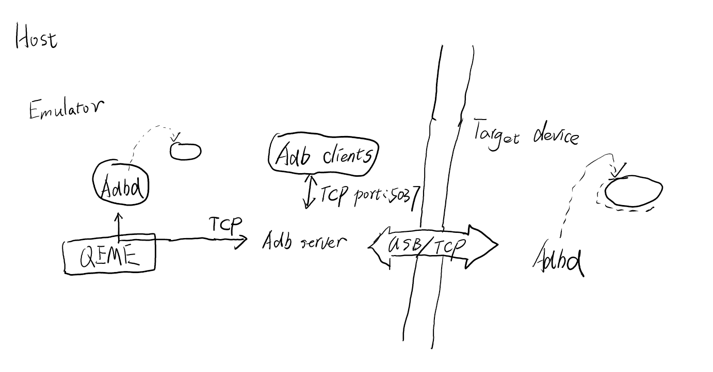

# app自动化测试

## Appium架构介绍与环境安装

Appium简介

对于客户端产品的UI界面的功能性测试，Appium是一个非常好的选择，它支持
Android、iOS以及Firefox系统的原生应用，网页应用以及混合应用，同时
也支持多语言，比如主流的语言Java、Python、Ruby、JS等。测试工程师
可以使用appium来辅助完成回归测试，冒烟测试等测试阶段的工作。

Appium架构

- 不要为自动化而重新编译或修改测试应用
- 不应该让移动端自动化测试限定在某种语言或某个具体的框架
- 不要为了移动端的自动化化测试而重新造轮子
- 移动端自动化测试应该是开源的


    webdriver script<-->appium Modules<-->移动端服务

Appium的核心是一个Web服务器，它提供了一套REST的接口。它接收到客户
端的连接，监听到命令，接着在移动设备上执行这些命令，然后将执行结果放
在HTTP响应中返还给客户端。事实上，这种客户端/服务端的架构给予了许多的
可能性，比如我们可以使用任何实现了该客户端的语言来写我们的测试代码，
比如我们可以把服务端放在不同的机器上，比如我们可以只写测试代码，然后
使用云服务来解释命令。

Appium设计思想的优势：

- 多语言的支持
- 可以把Server部署到任意机器上，也可以部署在云服务器上

Appium的工作引擎是第三方库，对Android、iOS底层使用了不同的工作引擎
驱动实现自动化测试。Appium引擎列表如下：

- iOS
    - The XCUITest Driver
    - （DEPRECATED）The UIAutomation Driver
- Android
    - （BEAT）The Espresso Driver
    - The UiAutomator2 Driver
    - （DEPRECATED）The UiAutomator Driver
    - （DEPRECATED）The Selendroid Driver
- The Windows Driver
- The Mac Driver

Appium环境安装

Appium Windows版本只支持Android系统，Appium Mac版本同时支持
Android系统和iOS系统。

## Windows系统环境搭建

软件列表：

* java 1.8
* Android SDK
* Appium Desktop(Appium Server)
* Appium client
* Android驱动

Java环境配置

    JAVA_HOME
    
    PATH
    
        %JAVA_HOME%\bin;%JAVA_HOME%\jre\bin;
        
    classpath
    
        .;%JAVA_HOME%\lib\dt.jar;%JAVA_HOME%\lib\tools.jar;

SDK 环境配置

    推荐使用Android Studio下载管理
    
    Android_HOME
    
    PATH
         
        %ANDROID_HOME%\tools;
        %ANDROID_HOME%\platform-tools

Appium Desktop
    
    ...
    
Appium Server

    npm install -g appium
    
    npm install -g cnpm --registry=https://registry.npm.taobao.org
    
    cnpm install -g appium
    
    命令行输入appium启动服务
    
Appium Client

    pip install appium-python-client
    
    from appium import webdriver
    
## Appium使用

    ...

adb 连接移动设备

    adb connect 127.0.0.1:7555
    
    adb devices

    # 设备需要打开调试模式
    
       
获取应用包名和页面名称

移动端的包名（也就是Package）作为每个app的唯一标识，每个app都有
自己的Package Name，且每个设备上相同的包名的APP，只允许安装一个。
页面（也就是Activity）是Android组件中最基本，也是最常见的四大组件
之一，可以理解为一个页面就是一个Activity，移动端打开一个APP的页面，
在操作页面的时候会发生页面的跳转，也就是Activity之间发生了切换。
在编写测试脚本之前，首先要获取应用的包名以及启动页的页面名。

    # 进入aapt所在目录（SDK下的build-tools目录下）
    
    aapt dump badging [app 名称].apk
    
    >>>
    
    package:name对应包名
    Lauchable-activity对应包门+页面名
    
    #但有些不符合规范的应用，aapt无法获取到到Lauchable-activity:name
    # 所以这里我们使用
    
        adb logcat|grep/findstr ActivityManager
        
    # 通过adb logcat也可以获取到包名和启动页的页面名。
    
## Appium-desktop自动化用例录制

1.启动Appium Server

使用Appium Inspector录制测试脚本，首先需要启动Appium-desktop，点击
“start Server”

2.打开inspect工具

3.配置Desired Capabilities信息

    platformName：使用哪个移动操作系统平台，这里可以填Android、iOS以及FirefoxOS
    
    deviceName：录入使用的移动设备或模拟器，这里可以随便填，但必须有此项
    
    appPackage: 录入你要启动的android应用程序包，我们填"io.appium.android.apis"
    
    appActivity: 录入App启动的首个Activity，我们填".ApiDemos"或者“io.appium.android.apis/.ApiDemos"
     
4.启动Session

    点击Start Session，开启下图界面
    
5.录制脚本

    Tap为点击元素
    
    Send keys为文本框录入
    
    Clear为清空文本框
    
    生成录制步骤脚本
    
## 元素定位方式与隐式等待

常见的定位方式

定位页面的元素有很多方式，比如ID、accessibility_id、Xpath等进行
元素定位，还可以使用Android、iOS工作引擎里面提供的定位方式。一般
情况下，如果元素的ID属性是唯一的，可以直接使用元素的id来进行元素定位
，非常快捷、高效。如果元素没有ID属性，或者页面相同ID属性的元素有
重复的，可以考虑其他的定位方式定位，比如XPath、accessibility_id，
复杂元素也可以使用组合定位的方式来进行元素定位。这节我们主要介绍ID与
accessibility_id进行元素定位

通过ID定位

在Android系统元素的ID称为resource-id，使用页面分析工具比如Appium
Inspector能够获取元素的唯一标识是ID属性，可以使用ID进行元素定位，
方便快捷。
    
    driver.find_element(By.ID,"android:id/text1").click()
    
通过content-desc定位

    driver.find_element_by_accessibility_id("Accessibility")
    
  
### 等待方式

- 强制等待time.sleep(5)
- 隐式等待driver.implicityl_wait(15)
- 显式等WebDriverWait(driver,10)

强制等待
    
    import time
    time.sleep(5)

隐式等待
    
    ...
    
    self.driver = webdriver.Remote(server, desired_caps)
    self.driver.implicitly_wait(15)
    
    # 查找元素时，10s内不停查找
    
## App控件定位

控件基础知识

客户端的页面通过XML来实现UI的布局，调整页面布局可以通过XML的修改来
达成目的。XML DOM定义访问和操作XML的标准方法。DOM将XML文档作为一个
树形结构，而树叶被定义为节点。这里的节点也就对应了我们要定义的元素，
节点的上级节点，定义了元素的布局结构。在XML DOM中可以使用XPath来进行
节点的定位。

其中包含的内容为：

- 节点node                                   
- 重点的节点属性：clickable、content-desc、resource-id、id、
text、bounds(坐标)

### 通过Xpath定位

与selenium类似，可以通过绝对定位和相对定位形式

Xpath：text属性定位

    driver.find_element(By.XPATH, '//*[@text="我的"]').click()
    
Xpath:resource-id属性定位

    driver.find_element(By.XPATH,'//*[@resource-id="rl_login_phone"').click()
                                       
Xpath:class属性定位

    driver.find_element(By.XPATH, '//*[@class="android.widget.EditText"]').click()
    
                                       
Xpath:content-desc属性定位

    driver.find_element(By.XPATH, '//*[@content-desc="搜索"]').click()                                     
    
#### Uiautomatorviewer介绍

使用SDK（sdk/tools/uiautomatorviewer)路径下自带的uiautomatorviewer工具

提前配置sdk/tools路径到环境变量@path，输入uiautomatorviewer打开工具
## 控件交互

查看apppium的API,使用IDE-pycharm

查看webdriver.py代码

### 常用API的介绍

点击操作

    self.driver.find_element_by_id("home_search").click()

输入操作

    send_keys()
    
获取元素的属性

    self.driver.find_element_by_xpath('..').get_attribute('..')
    
get_attribute()源码地址：
    
    https://github.com/appium/appium-uiautomator2-server/blob/master/app/src/main/java/io/appium/uiautomator2/handler/GetElementAttribute.java
    
获取text属性

    self.driver.find_element_by_xpath('..').get_attribute('..')

获取class属性

    self.driver.find_element_by_xpath('..').get_attribute('class')

获取resource-id属性

    self.driver.find_element_by_xpath('..').get_attribute('resource-id')

获取content-desc属性

    self.driver.find_element_by_xpath('..').get_attribute('content-desc')
    
获取元素的其他属性

    get_attribute('clickable')                        
    get_attribute('checked')                        
    get_attribute('displayed')                        
    get_attribute('enabled')                        
    # 返回true或者false
    
#### 获取页面源码

    from appium import webdriver
    
    ...
    driver.page_source

#### 触屏操作自动化

滑动、长按、拖动操作

[具体用法](https://github.com/appium/appium/blob/master/docs/en/writing-running-appium/touch-actions.md)

导入TouchAction
    
    from appium.webdriver.common.touch_action import TouchAction

常用的手势操作

- Press            
- release           
- move_to           
- tap(Press+release)           
- wait           
- longPress长按           
- cancel取消           
- perform执行           

Press

    press(WebElement el)
    
    press(int x, int y)
    
    press(WebElement el, int x, int y)

release

    release(WebElement el)
    
    release() #上一个操作之后执行release

move_to

    move_to(WebElement el)
    
    move_to(WebElement el, int x, int y)

tap

    tap(WebElement el)
    
    tap(int x, int y)
    
    tap(WebElement el, int x, int y) # 以el的左上角为基准版
    
wait

    wait()
    wait(long timeout)
    wait(long timeout, int nanos)
    
longpress

    源码为：
    
        self._add_action('longPress', self._get_opts(el, x, y, duration))
        
        return self
        
    long_press(WebElement el)
    
    long_press(int x, int y)
    
    long_press(WebElement el, int x, int y)
    
cancel

    将事件链中的事件取消执行的动作
    
    cancel()
    
perform
    
    执行
    perform()
    
案例
    
    from appium import webdriver
    form appium.webdriver.common.touch_action import TouchAction
    
    class TestTouchAction():
        def setup(self):
            caps = {}
            caps['platformName'] = 'Android'
            caps['platformVersion'] = '6.0'
            caps['deviceName'] = 'emulator-5554'
            caps['appPackage'] = 'io.appium.android.apis'
            caps['appActivity'] = 'io.appium.android.apis.ApiDemos'
            self.driver = webdriver.Remote("http://127.0.0.1:4723/wd/hub,caps)
            self.driver.implicityl_wait(5)

        def teardown(self):
            self.driver.quit()
            
        def test_touchaction_unlock(self):
            el1 = self.driver.find_element_by_accessibility_id("Views")
            el2 = self.driver.find_element_by_accessibility_id("Accessibility")
            action = TouchAction(self.driver)
            action.press(el1).wait(100).move_to(el2).wait(100).release().perform()
            
## 高级定位技巧

通过使用定位器定位页面上的元素会发生一些定位不到元素，需要使用高级定位技巧

### Xpath高级定位技巧

XML Path Language，对XML中的元素进行路径定位的语言，它可适用XML
标记语言，HTML标记语言，app Dom结构。XPath是自动化工具的定位基础，
可适用于Selenium、Appium、Appcrawler。

Xpath 基本语法

- /bookstore/book[1]                                                                
- /bookstore/book[last()]                                                                
- /bookstore/book[last()-1]                                                                
- /bookstore/book[position()<3] #选取最前面的两个属于bookstore元素的子元素的book元素                                                               
- //title[@lang='eng']                                                                
- /bookstore/book[price>35.00]                                                                
- /bookstore/book[price>35.00]/title

说明：

- nodename                                                                
- /                                                                
- //                                                                
- .                                                                
- ..                                                                
- @

XPath模糊定位

contains()方法时模糊匹配的定位方式

    driver.find_element(By.XPATH, '//*[contains(@text, "注册")]').click()                                                                

Xpath 组合定位技巧

    driver.find_element(By.XPATH, '//*[@text="我的" and @resource-id="tab_name"]'

XPath层级定位

- 通过子元素定位父元素
```
    # 方法一 ..
    
    driver.find_element_by_xpath('//*[@text="手机号"]/..').tag_name

    # 方法二 parent::*
    
    driver.find_element_by_xpath('[@text="手机号"]/parent::*').tag_name
```    
- 通过元素定位兄弟元素    
```
    driver.find_element_by_xpath('//*[@text="手机号"]/../li').tag_name
```

### Android UiAutomator 定位技巧

当Appium脚本的uiautomationName设置为UiAutomator2时，就能够实现
与手机端的Uiautomator进行通信并且使用Uiautomator执行我们的测试代码，
下面就单独介绍其基于uiautomator定位元素的方法

    driver.find_element_by_android_uiautomator()
    
    UiSelector()
    UiScrollable()
    
通过text文本定位

UiSelector()与XPath类似，可以通过元素的text属性来定位元素。
    
    new UiSelector().text("text 文本")
    
    driver.find_element_by_android_uiautomator('new UiSelector().text("手机号")').click()
            
    driver.find_element_by_android_uiautomator('new UiSelector().textContains("手机")').click()
            
    driver.find_element_by_android_uiautomator('new UiSelector().textStartsWith("手")').click()        

通过resourceId定位语法

    new UiSelector().resourceId("resource-id属性")     
    
    driver.find_element_by_android_uiautomator\
    ('new UiSelector().resourceId("rl_login_phone")').click()        
    
通过class定位语法

    new UiSelector().className("className")
    
    ...
    
通过contenet-desc定位语法

    new UiSelector().description("contenet-des属性")
    
组合定位方式

    格式为function("xxx").function("xxx")
    
    'new UiSelector().resourceId(\
    "com.xueqiu.android:id/tv_login_phone").text("手机号")').click()
 
滚动查找元素

Uiautomator()定义了滚动查找元素的功能

    'new UiScrollable(new UiSelector().scrollable(true)\
    .instance(0)).scrollIntoView(new UiSelector()\
    .text("我的")..instance(0));'
    
## 显示等待机制

显示等待可以等待动态加载的ajax元素，比隐式等待更加灵活的定位元素。
显式等待用到的两个类：WebDriverWait和expected_conditions

WebDriverWait类解析

    WebDriverWait(driver, timeout, poll_frequency=0.5,ignored_exceptions=None)
    
参数解析：

- driver: WebDriver对象                
- timeout: 最长等待时间，单位秒               
- poll_frequency:检测的间隔步长，默认为0.5s               
- ignored_exceptions:执行过程中忽略的异常对象，默认只忽略TimeoutException异常类

WebDriverWait通常与until和until_not结合使用               

- until(method, message=''),不停调用method，直到返回不为False           
- until_not(method, message=''),不停调用method，直到返回为False           

## expected_conditions类解析

expected_conditions类是selenium的一个模块，其中包含一系列可用于
判断的条件。

    from selenium.webdriver.support import  expected_conditions
    
方法介绍

1.presence_of_element_located(locator)方法，判断元素是否被加入到DOM树种

2.visibility_of_element_located(locator)方法，用来判断某个元素是否可见

    WebDriverWait().until(\
        expected_conditions.presence_of_element_located(元素对象))
        
3.element_to_be_clickable(locator)方法，判断某元素是否可见并点击

    WebDriverWait().until(
        expected_conditions.element_to_be_clickable((By.ID,'kw')))
        

## 特殊控件Toast识别

Toast是Android系统中的一种消息框类型，它属于一种轻量级的消息提示，常常以小
弹框的形式出现，一般出现1到2秒会自动消失，可以出现在屏幕上中下任意位置。

[测试App下载](https://github.com/appium/sample-code/raw/master/sample-code/apps/ApiDemos/bin/ApiDemos-debug.apk)

路径

    Views---Popup Menu---Make a Popup---Search
    
#### Toast源代码

    private void addToastMsgToRoot(CharSequence tokenMSG){
        AccessibilityNodeInfo node = AccessibilityNodeInfo.obtain();
        node.setText(tokenMSG);
        node.setClassName(Toast.class.getName());
        node.setPackageName("com.android.settings");
        
        this.children.add(
            new UiAutomationElement(
                node,
                this                ));
    }

- node.setText设置节点文本信息为该toast内容                               
- node.setClassName设置节点类名为该toast的类名                              
- node.setPackageName设置节点包为android的系统进程

#### 使用shell命令排查定位Toast

1.启动session

2.获取session ID

    session_id=`curl http://127.0.0.1:4723/wd/hub/sessions|awk -F\" '{print $8}'`
    
    
3.查看Toast获取过程

    while true:do
        sleep 0.5
        http://127.0.0.1:4723/wd/hub/session/$session_id/elements\
        --data-binary \
        '{"using":"xpath","value":"//*[@class=\"android.widget.Toast\"]"}'\
        -H "Content-Type: application/json;charset=UTF-8"

#### 使用代码获取Toast

1.设置capability

    caps = {}
    caps['platformName'] = 'Android'
    caps['deviceName'] = 'emulator-5554'
    caps['appPackage'] = 'io.appium.android.apis'
    caps['appActivity'] = '.ApiDemos'
    # 必须使用uiautomator2框架
    caps["automationName"] = "uiautomator2"
    caps["udid"] = "192.168.56.101:5555"
    
    driver = webdriver.Remote("...", caps)
    
2.编写测试用例代码
    
    driver.find_element_by_accessibility_id("Views").click()
    
    TouchAction(driver).long_press(380, 1150).move_to(380, 10).release().perform()
    
    driver.find_element_by_xpath("//*[@content-desc='Make a Popup!']").click()
    
    driver.find_element_by_xpath("//*[contains(@text,'Search')]").click()
    
    toastXpath = "//*[@class='android.widget.Toast']"
    
    print(driver.find_element_by_xpath(toastXPath).text)
    
3.查看执行结果

    class='android.widget.Toast'     
    
    
## 属性获取与断言

常规的UI自动化断言

- 比较大小
- 包含或者不包含
- 验证布尔值
    
#### assert断言

...
    
#### Hamcrest断言

Hamcrest是一个为了测试为目的，能组成合成灵活表达式的匹配器类库。用
与编写断言的框架，使用这个框架编写断言，可以提高可读性以及开发测试的
效率。Hamcrest提供了大量被称为“匹配器”的方法。每个匹配器都设计用于
执行特定的比较操作。Hamcrest的可扩展性强，允许你创建自定义的匹配器。
支持多种语言，java，python，ruby，object-c，php，erlang，swift           

使用方法

安装

    pip install pyhamcrest
    
导入
    
    from hamcrest import *
    
常用方法API

- assert_that("this is a string", equal_to("this is a string"))                                             
- assert_that(1, close_to(0.5, 0.5))                                             
- assert_that('abc', contains_string('d'))                                            
- assert_that("matches", contains_inanyorder(*"hamcrest"))
- close_to(expect_price, expect_price*0.1)

#### 参数化用例

使用方法

使用Appium测试框架编写测试用例时，通常会结合pytest测试框架一起使用。
使用pytest的参数化机制，可以减少代码重复，在测试代码前添加装饰器

    @pytest.mark.parametrize("argvnames", argvalues)

@pytest.mark.parametrize()需要传入两个参数"argnamest"与"argvalues",
第一个参数需要一个或者多个变量来接收列表中的每组数据，第二个参数传递
存储数据的列表。

    import pytest
    
    @pytest.mark.parametrize("test_input, expected",[("3+5", 8), ("2+4", 6), ("6*9",42)])
    def test_eval(test_input, expected):
        assert eval(test_input) == expected

案例

    ...
    assert_that(price, close_to(expect_price, expect_price* 0.1))


## Android WebView测试

Hybird App，本质上是Native-app中嵌入WebView组件，在WebView组件
里可以访问Web App。Hybrid App在给用户良好交互体验的同时，还具备了
WebApp的跨平台、热更新机制等优势。

Android WebView在Android平台上是一个特殊的View，用它来展示网页
内容。WebView内部实现是采用渲染引擎来展示View的内容，提供网页前进
后退、网页放大、缩小、搜索等功能。使用WebView进行测试需要开发人员
配合打卡一个WebView的开关，否则没有办法进行测试这一部分的功能。

#### WebView开关

WebView是手机应用内嵌的浏览器，在Android 4.4之前WebView内核采用
的是WebKit，Android 4.4之后才用的是Chrome作为内置浏览器。它是用
来加载HTML的页面的控件。在模拟器（android6.0版本）中是默认打开
WebView开关的，可以直接调试和测试WebView。真机上必须从您的应用中
启用WebView调试。要启用WebView调试，请在WebView类上调用静态方法
setWebContentsDebuggingEnabled

#### WebView源代码

    if (Buid.VERSION.SEK_INT >= Build.VERSION_CODES.KITKAT){
        WebView.setWebContentSDebuggingEnabled(true);
        }
    
    此设置适用于应用的所有WebView
    
WebView调试不会受应用清单中debuggable标志的状态的影响。如果你希望
仅在debuggable为true时启用WebView调试，请在运行时测试标志。

    if (Buid.VERSION.SEK_INT >= Build.VERSION_CODES.KITKAT){
        if (0 != (getApplicationInfo().flags &\
        ApplicationInfo.FLAG_DEBUGGABLE))
        {WebView.setWebContentSDebuggingEnabled(true);}
        }
        
之后在PC端Chrome浏览器地址栏输入"chrome://inspect"将显示您的设备上
已启用调试的WebView列表。要开始调试，请点击您要调试的WebView下方的
inspect。像使用远程浏览器标签一样使用DevTools。
 
 
#### WebView测试额外安装步骤

如果执行WebView测试时，出现：An unknown server-side error occurred
while processing the command.Original error:unknown error:
Chrome version must be >= 55.0.2883.0

说明你的Chrome浏览器版本和Chromedriver版本不匹配，需要设置匹配的版本，
查询版本的匹配关系详情可以查询

[chromedriver.md](htps://github.com/appium/appium/blob/master/docs/en/writing-running-appium/web/chromedriver.md)


#### WebView测试

WebView测试需要切换到WebView页面，就可以使用Selenium的一整套API
操作WebView页面。切换的方式即driver.switch_to.context方法可以从
原生页面切换到WebView页面，示例代码如下：

    WebView= driver.contexts[-1]
    driver.switch_to.context(webview)
    
#### WebView案例

    def test_webview():
        driver.find_element(MobileBy.XPATH, '//*[@text="交易"]').click()
        print(driver.contexts)
        driver.switch_to.context(self.driver.contexts[-1])
        print(driver.window_handles)
        A_locator = (MobileBy.XPATH, '//*[@id="Layout_app_3V4"]/div/div/ul/li[1]/div[2]/h1')
        WebDriverWait(driver, 10).until(expected_conditions.element_to_be_clickable(A_locator))
        
#### 设备交互API

Appium提供了很多操作系统，比如在操作APP的过程中来电话、短信、横竖屏切换，
安装卸载APP，手机上的键盘操作，录屏等功能。下面介绍几个常用的设备交互API。

[更多用法参考官网](http://appium.io/docs/en/about-appium/intro)

模拟电话/短信

    self.driver.make_gsm_call("5551234567", GsmCallActions.CALL);
    
    self.driver.send_sms('555-123-4567', "Hey lol')

横竖屏切换

    官方暂不支持python，以下是java代码。
    
    切换成横屏
    driver.rotate(Screenorientation.LANDSCAPE)
    
    切换成竖屏
    driver.rotate(Screenorientation.PORTPAIT)
    
App处理

    install_app() # 安装app
    
        self.driver.install_app("/User/johndoe/path/to/app.apk")
    
    is_app_installed() # 检测app是否被安装
    
        self.driver.is_app_installed("com.example.AppName');
        
    launch_app() # 启动APP
    
        self.driver.launch_app()

键盘
    
[键盘事件可以参考Android官网](https://developer.android.com/reference/android/view/KeyEvent.html)                                                
  
    self.driver.press_keycode(10)
    self.driver.long_press_keycode(10)
    self.driver.hide_keyboard()
    self.driver.is_keyboard_shown()

剪贴板

    # 设置系统剪贴板内容
    self.driver.set_clipboard("happy testing")
    self.driver.set_clipboard_text("happy testing")
            
    # 获取到剪贴板内容
    self.driver.get_clipboard()
    self.driver.get_clipboard_text() 
    
## Capability使用进阶

Appium客户端如果想请求新的Session，就需要发送Capabilities给服务器。
Capabilities让Drivers知道你的行为，客户端使用特定语言产生Capabilities
(比如java，python），最终会以JSON对象的形式发送给Appium服务端。

Appium 底层架构



下面使用appium在iOS11的iPhone 7 模拟器上开始创建session，使用XCUITest
驱动程序，使用/path/to/my.app程序进行测试。
    
    {
        "platformName": "iOS",
        "platformVersion": "11.0",
        "deviceName": "iPhone 7",
        "automationName": "XCUITest",
        "app": "/path/to/my.app"
    }
    
## 通过的Capability参数

### 通用的Capability参数

automationName  
    
    自动化测试引擎

platformName    
    
    使用手机操作系统    

platformVersion 

    手机操作系统的版本

deviceName  
    
    使用手机或模拟器的类型 

app 
    
    本地绝对路径或远程http_url所指向的一个安装包

    如果指定了appPackage和appActivity参数，Android则不需要此参数了。
    
    该参数与browserName不兼容
    
browser 

    自动化时使用的浏览器名字

newCommandTimeout   

    用于客户端在退出或结束session之前，Appium等待客户端发送一条新命令所花费的时间（秒为时间）                               

language 

    模拟器语言
    
locale

    设备所在区域
    
udid

    真机唯一设备号
    
orientation

    模拟器当前的方向

autoWebview

    直接转换到Webview上下文（context），默认值为false

noReset

    在当前session下不会重置应用的状态，默认值为false
    
fullReset

    删除所有的模拟器文件夹、清除app里的数据，请将应用卸载才能达到重置应用的效果。
    
### Android Only

appActivity

appPackage

appWaitActivity

appWaitPackage

appWaitDuration

deviceReadyTimeout

androidCoverage

enablePerformanceLogging

### iOS Only

calendarFormat

bundleId

udid

launchTimeout

locationServicesEnable

locationServicesAuthorized

autoAcceptAlerts

autoDismissAlerts

nativeInstrumentsLib

nativeWebTap

### 扩展

[Capabilities](http://appium.io/docs/en/writing-running-appium/caps/)


## Appium WebView技术原理

WebView日志分析

首先我们在Capabilities里增加一项配置showChromedriverLog,让Appium
能够生成Chromedriver相关的日志，默认是不打印Chromedriver这部分日志的。
代码如下：

    capabilities['showChromedriverLog'] = True
    
启动AppiumServer并将生成的所有日志存储到文件/tmp/appium.log中：
    
    appium -g /tmp/appium.log
    

关键日志分析

下面我们对/tmp/appium.log文件中的关键日志进行详细的分析。

...                                                                            

## Appium问题分析定位

- [Appium参数](http://appium.io/docs/en/writing-running-appium/server-args/)
- [defaultCapabilities](http://appium.io/docs/en/writing-running-appium/default-capabilities-arg)

Session日志

[desired capabilities](http://appium.io/docs/en/writing-running-appium/caps)

Appium GET 请求的日志

[REST服务](https://en.wikipedia.org/wiki/Representationsl_state_transfer)

     日志
     
"->"代表发送HTTP请求，"<-"代表返回请求的结果，中间是指令细节。使用
MJSONWP（Mobile JSON Wire Protocol协议）去调用AppiumDriver.getStatus()
这个方法带着空列表作为参数，返回给客户端result：信息，整个过程耗时121
毫秒，传输了126个字节。

...

## 改变日志输出的参数

- -log-level:改变Appium日志显示级别。Appium默认展示所有日志，它有以下一些选项

        'info'
        'info:debug'
        'info:info'
        'info:warn'
        'info:error',...
        
        
    
- -log-no-colors:关闭颜色，如果是彩色，可能会出现奇怪的提示

- -log-timestamp:在日志前添加时间戳，在排查超时错误时有奇效

## 过滤appium日志

    grep "HTTP .*  <\-\-" /tmp/appium.log
    
打印更多chromedriver信息

    caps['showChromedriverLog'] = True
    
## adb架构有三个

- adb client         
- [adb server通信协议](https://github.com/cstyan/adbDocumentation)        
- adbd

其中adb server与adbd进行通信，adb client与adb server进行通信：




下图是adb server和adbd，可以发现，chromeDriver没有使用adb，而
直接与adb server进行通信：

    ps -ef | grep adb
    
    ps -ef | grep adb
    
    adb shell ps | grep adbd
    
## 利用adb获取log

Appium调用adb执行一些操作，我们可以改写成adb，当Appium调用adb时，
会代用假的adb，假adb如下：

- 打印当前进程       
- 打印父进程      
- 打印命令      
- 判断该命令是不是logcat命令，如果是，正常执行      
- 如果命令不是logcat，打印命令，正常执行。

    
    echo "# $$ "$(date "+%Y/%m/%d %H:%M:%S") >> /tmp/adb.log
    
    echo "#ppid: $(ps -o command $(ps -o ppid $$ | tail -1)\
    |tail -1)" >> /tmp/adb.log
    
    echo "adb $@" >> /tmp/adb.log
    if echo "$@"| grep logcat;then
        echo "origin run" >> /tmp/adb.log
        exec /Users/seveniruby/Library/Android/sdk//platform-tools\
        /adb.bak "$@"
    else
        /Users/seveniruby/Library/Android/sdk//platform-tools/adb.bak\
        "$@" | while read line;do
        echo "$line" >> /tmp/adb.log
        echo "$line"
        done
    fi
    echo "" >> /tmp/adb.log
    
当运行Appium程序的时候，一旦发现有adb的命令，就使用封装的adb，首先
在使用adb之前输出当时的日期时间日志，判断命令是否是有logcat字符，如果
有则运行adblogcat命令，打印这条然后收集调用它的进程日志。                  

        

